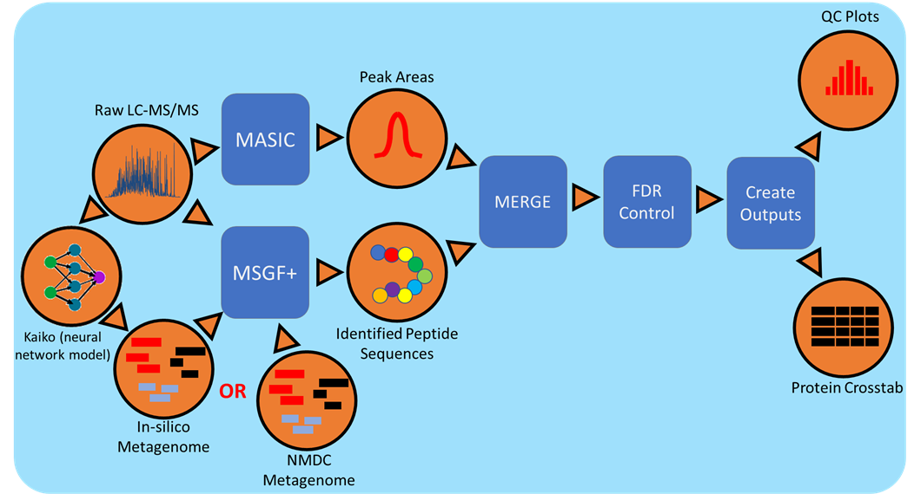

# Meta-proteomics workflow.

  

## About
<!-- Meta-proteomics workflow is an end-to-end data processing and analyzing pipeline for studying proteomes i.e studying [protein identification and characterization using MS/MS data](https://www.sciencedirect.com/science/article/pii/S1874391911002053). -->

The NMDC metaproteomics workflow is an end-to-end data processing pipeline for studying the proteomes of complex communities using data dependent LC-MS/MS data. The workflow matches the sequences from a metagenome annotation to fragmentation spectra (MS2) in the mass spectrometry data to identify peptide sequences, which are fragments of proteins contained in a processed proteomic sample. The metagenome annotation can either come from genomic sequencing that has been processed using the NMDC metagenomics pipeline, or for the more recent development that removes the paired NMDC metagenome requirement, by utilizing a neural network model to identify peptide sequences de novo from the fragmentation spectra (MS2). This sequence information is then used to identify model organisms with genome sequences archived on UniProt. The matched organisms genomes are then concatenated to create a pseudo-metagenome for in-depth peptide identification. Relative abundance measurements are derived by taking the area under the LC elution curve for the peptide from the intact spectra (MS1).
Metaproteomics analyses identify the active organisms/species in a microbial community through the identification and relative quantification of protein expression.

**Note: The WDL implementation of the workflow is currently the only version of the pipeline in active development. The legacy Python implementation of the pipeline is currently not maintained.**

### Running the workflow:

- WDL workflow:

    1. prepare you input.json
       Note: User need to generate the input.json file based on the 
             - mapping (dataset(raw) to annotations(.faa & .gff ))
             - actual files respective file locations. 

    2. run the WDL:
       - execution engine(tested with [cromwell-66](https://github.com/broadinstitute/cromwell/releases)) to run WDL 
       - along with Java runtime(tested with `openjdk 12.0.1`)
             1. if docker support 
                1. `make run_wdl`
             2. if shifter support to run on cori:
                1. `make run_wdl_on_cori`

[More about workflow...](docs/index.rst)

[Documentation](https://nmdc-proteomics-workflow.readthedocs.io/en/latest/)
