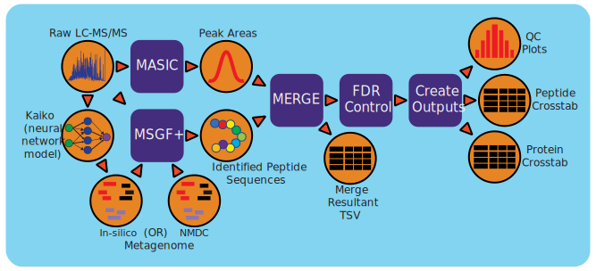

:github_url: https://github.com/microbiomedata/metaPro/blob/master/docs/index.rst

..
   Note: The above `github_url` field is used to force the target of the "Edit on GitHub" link
         to be the specified URL. That makes it so the link will work, regardless of the Sphinx
         site the file is incorporated into. You can learn more about the `github_url` field at:
         https://sphinx-rtd-theme.readthedocs.io/en/stable/configuring.html#confval-github_url

Metaproteomic Workflow (v1.2.1)
========================================

Workflow Overview
-------
The NMDC metaproteomics workflow is an end-to-end data processing pipeline for studying the proteomes of complex communities using data dependent LC-MS/MS data. The workflow matches the sequences from a metagenome annotation to fragmentation spectra (MS2) in the mass spectrometry data to identify peptide sequences, which are fragments of proteins contained in a processed proteomic sample. The metagenome annotation can either come from genomic sequencing that has been processed using the NMDC metagenomics pipeline, or for the more recent development that removes the paired NMDC metagenome requirement, by utilizing a neural network model to identify peptide sequences de novo from the fragmentation spectra (MS2). This sequence information is then used to identify model organisms with genome sequences archived on UniProt. The matched organisms genomes are then concatenated to create a pseudo-metagenome for in-depth peptide identification. Relative abundance measurements are derived by taking the area under the LC elution curve for the peptide from the intact spectra (MS1).
Metaproteomics analyses identify the active organisms/species in a microbial community through the identification and relative quantification of protein expression.

Workflow Availability
---------------------

The workflow from GitHub uses all the listed docker images to run all third-party tools.
The workflow is available in GitHub: https://github.com/microbiomedata/metaPro. 
The corresponding Docker images are available in DockerHub: 
   - https://hub.docker.com/r/microbiomedata/metapro-post-processing
   - https://hub.docker.com/r/microbiomedata/metapro-metadatacollection
   - https://hub.docker.com/r/microbiomedata/metapro-msconvert
   - https://hub.docker.com/r/microbiomedata/metapro-msgfplus
   - https://hub.docker.com/r/microbiomedata/metapro-proteindigestionsimulator
   - https://hub.docker.com/r/microbiomedata/metapro-peptidehitresultsprocrunner
   - https://hub.docker.com/r/microbiomedata/metapro-mzidmerger
   - https://hub.docker.com/r/microbiomedata/metapro-masicresultsmerge
   - https://hub.docker.com/r/microbiomedata/metapro-mzidtotsvconverter
   - https://hub.docker.com/r/microbiomedata/metapro-fastafilesplitter
   - https://hub.docker.com/r/microbiomedata/metapro-masic
   - https://hub.docker.com/r/camiloposso15/kaiko_2.0-py3.10

Requirements for Execution
--------------------------

(recommendations are in **bold**):
  
- WDL-capable Workflow Execution Tool (**Cromwell**)
- Container Runtime that can load Docker images (**Docker v2.1.0.3 or higher**) 

Hardware Requirements
---------------------

- 250 GB of disk space for static files, results, and intermediate files
- Recommended to run with 32 GB of RAM or more 

Workflow Dependencies
---------------------
 
- `MASIC v3.2.7901 <https://github.com/PNNL-Comp-Mass-Spec/MASIC>`_ (License: `BSD-2-Clause <https://opensource.org/licenses/BSD-2-Clause>`_)
- `FASTA File Splitter v1.1.7887 <https://github.com/PNNL-Comp-Mass-Spec/Fasta-File-Splitter>`_ (License: `BSD-2-Clause <https://opensource.org/licenses/BSD-2-Clause>`_)
- `MzIDMerger v1.3.0 <https://github.com/PNNL-Comp-Mass-Spec/MzidMerger>`_ (License: `BSD-2-Clause <https://opensource.org/licenses/BSD-2-Clause>`_)
- `Mzid-To-Tsv-Converter v1.4.6 <https://github.com/PNNL-Comp-Mass-Spec/Mzid-To-Tsv-Converter>`_ (License: `BSD-2-Clause <https://opensource.org/licenses/BSD-2-Clause>`_)
- `Peptide Hit Results Processor v3.0.7842 <https://github.com/PNNL-Comp-Mass-Spec/PHRP>`_ (License: `BSD-2-Clause <https://opensource.org/licenses/BSD-2-Clause>`_)
- `Protein Digestion Simulator v2.3.7794 <https://github.com/PNNL-Comp-Mass-Spec/Protein-Digestion-Simulator>`_ (License: `BSD-2-Clause <https://opensource.org/licenses/BSD-2-Clause>`_)
- `Proteowizard v3.0.21258 <https://proteowizard.sourceforge.io/download.html>`_ (License: `Apache License, Version 2 <https://proteowizard.sourceforge.io/licenses.html>`_)
- `MS-GF+ v2022.04.18 <https://github.com/MSGFPlus/msgfplus>`_ (License: `MS-GF+ License <https://github.com/MSGFPlus/msgfplus/blob/master/LICENSE.txt>`_)
- `MASIC Results Merger v2.0.7983 <https://github.com/PNNL-Comp-Mass-Spec/MASIC-Results-Merger>`_ (License: `Apache License, Version 2 <https://opensource.org/licenses/Apache-2.0>`_)
- `Sqlite <https://www.sqlite.org/index.html>`_ (License: `Public Domain <https://www.sqlite.org/copyright.html>`_)
- `Kaiko <https://github.com/microbiomedata/kaiko_metaproteome>`_ (License: `BSD-2-Clause <https://opensource.org/licenses/BSD-2-Clause>`_)

Sample Dataset
-----------------

A sample dataset is forthcoming.

Input
-----

A JSON file containing the following information:

1. A mapper list "metapro.mapper_list" containing an array of JSON objects for mapping paths of .raw files, FASTA, GFF, and additional metadata
   a. "genome_dir": The NMDC Identifier for the parent omics processing record, used when generating NMDC metadata. This input will be renamed in the future.
   b. "dataset_name": The name of the mass spec data file without extension. This input will be removed in the future.
   c. "annotation_name": The FASTA file name without extension. This input will be removed in the future.
   d. "raw_file_loc": The local filepath to the mass spec data file.
   e. "dataset_id": The NMDC Identifier of the mass spec data file, used when generating NMDC metadata.
   f. "faa_file_loc": The local filepath to the FASTA file.
   g. "faa_file_id": The NMDC Identifier of the FASTA file, used when generating NMDC metadata.
   h. "gff_file_loc": The local filepath to the GFF file.
   i. "gff_file_id": The NMDC Identifier of the GFF file, used when generating NMDC metadata.
2. Path to a MS-GF+ parameter file, example `file <https://github.com/microbiomedata/metaPro/blob/master/storage/parameters/LTQ-FT_10ppm_2014-08-06.xml>`_
3. Path to a MASIC parameter file, example `file <https://github.com/microbiomedata/metaPro/blob/master/storage/parameters/MSGFPlus_Tryp_NoMods_20ppmParTol.txt>`_
4. Path to a contaminant FASTA file
5. The Q-Value threshold
6. A study name, used when generating NMDC metadata.
7. The name of the execution resource this pipeline was ran on, used when generating NMDC metadata.
8. A URL for where resulting metada can be located, used when generating NMDC metadata.
9. The NMDC Identifier of the MASIC parameter file, used when generating NMDC metadata.
10. The NMDC Identifier of the MS-GF+ parameter file, used when generating NMDC metadata.
11. The NMDC Identifier of the contaminant FASTA file, used when generating NMDC metadata.
12. A boolean value indicating whether Kaiko should be used or not.
13. Path to a Kaiko configuration file.

An example input JSON file is shown below::

   {
   "metapro.mapper_list": [
      {
         "genome_dir": "nmdc_omprc-11-wfzppa38",
         "dataset_name": "SpruceW_P4_15A_22Jun17_Pippin_17-04-06",
         "annotation_name": "nmdc_wfmgan-11-pmh0a992.1",
         "raw_file_loc": "/mnt/d/NMDC/nmdc_bsm-13-bgefg837/SpruceW_P4_15A_22Jun17_Pippin_17-04-06.raw",
         "dataset_id": "nmdc_dobj-11-9gcej008",
         "faa_file_loc": "/mnt/d/NMDC/nmdc_bsm-13-bgefg837/nmdc_wfmgan-11-pmh0a992.1_proteins.faa",
         "faa_file_id": "nmdc_dobj-11-j5mh8584",
         "gff_file_loc": "/mnt/d/NMDC/nmdc_bsm-13-bgefg837/nmdc_wfmgan-11-pmh0a992.1_functional_annotation.gff",
         "gff_file_id": "nmdc_dobj-11-jq8ct440"
      }
   ],
   "metapro.MASIC_PARAM_FILE_LOC": "/mnt/d/NMDC/reprocessing_spruce_2/LTQ-FT_10ppm_2014-08-06.xml",
   "metapro.MSGFPLUS_PARAM_FILE_LOC": "/mnt/d/NMDC/reprocessing_spruce_2/MSGFPlus_Tryp_NoMods_20ppmParTol.txt",
   "metapro.CONTAMINANT_FILE_LOC": "/mnt/d/NMDC/reprocessing_spruce_2/Tryp_Pig_Bov.fasta",
   "metapro.QVALUE_THRESHOLD": "0.05",
   "metapro.STUDY": "spruce",
   "metapro.EXECUTION_RESOURCE": "EMSL",
   "metapro.DATA_URL": "https://nmdcdemo.emsl.pnnl.gov/proteomics/results/",
   "metapro.MASIC_PARAM_FILE_ID": "nmdc_dobj-11-hfx93f93",
   "metapro.MSGFPLUS_PARAM_FILE_ID": "nmdc_dobj-11-h9637w90",
   "metapro.CONTAMINANT_FILE_ID": "nmdc_dobj-11-sprrem27",
   "metapro.METAGENOME_FREE": false,
   "metapro.KAIKO_PARAM_FILE_LOC": "/mnt/d/NMDC/parameters/kaiko_defaults.yaml"
   }

Output
------

The workflow will produce four results files:
   - <dataset_id_faa_file_id>_Peptide_Report.tsv
   - <dataset_id_faa_file_id>_Protein_Report.tsv
   - <dataset_id_faa_file_id>_QC_metrics.tsv
   - <dataset_id_faa_file_id>_msgfplus_syn_PlusSICStats.txt
   - If METAGENOME_FREE is true, the FASTA file generated by Kaiko
   - If METAGENOME_FREE is true, the GFF file generated by Kaiko

Version History
---------------

- 1.2.1
- 1.2.0
- 1.0.0

Point of contact
----------------

Package maintainer: Cam Giberson <cameron.giberson@pnnl.gov>
