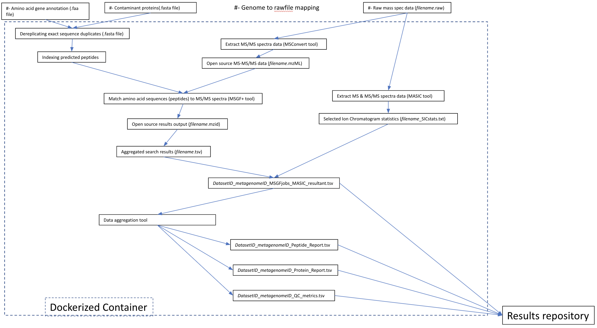

Metaproteomic Workflow (v2.0.0)
==============================

Summary
-------
The metaproteomics workflow/pipeline is an end-to-end data processing workflow for protein identification and characterization using MS/MS data. Briefly, mass spectrometry instrument generated data files(.RAW) are converted to mzML, an open data format, using MSConvert. Peptide identification is achieved using MSGF+ and the associated metagenomic information in the FASTA (protein sequences) file format. Intensity information for identified species is extracted using MASIC and combined with protein information.

-  **Processing components:**

   -  `msConvert <http://proteowizard.sourceforge.net/tools/msconvert.html>`__
      : A command-line tool converting to/from various mass spectrometry
      data formats including multiple proprietary formats. It
      converts.RAW to `mzML <http://www.psidev.info/mzML>`__. Converting
      to mzML which is an `open data
      format <https://www.ncbi.nlm.nih.gov/pmc/articles/PMC3518119/>`__
      makes easy for academic scientists to directly manipulate MS/MS
      spectrum data. Open formats enable improved data sharing by
      allowing the data to be read by a variety of software tools
      without licensing restrictions
   -  `MS-GF+ <https://www.nature.com/articles/ncomms6277>`__ which
      performs peptide identification by scoring MS/MS spectra against
      peptides derived from a protein sequence database (FASTA files).
      Individual peptide sequences are identified(mzML file), then the
      set of peptide sequences is used to infer which proteins may have
      been present. It reads an open data format for MS/MS
      identification i.e mzML files and searches again a protein
      database(FASTA) to outputs a .mzId file which constitutes a set of
      scored PSMs along with *E*-value estimates( i.e computes
      *E*-values of PSMs and estimates FDRs)
   -  `MzidToTSVConverter <https://msgfplus.github.io/msgfplus/MzidToTsv.html>`__
      to converts MS-GF+ output (**.mzid**) into the tsv format
      (**.tsv**).
   -  `PeptideHitResultsProcessor <https://omics.pnl.gov/software/peptide-hit-results-processor>`__,
      converts tsv format (**.tsv**) to syn.txt file used for downstream
      analyses.
   -  `MASIC <https://www.ncbi.nlm.nih.gov/pmc/articles/PMC2487672/>`__
      which extracts intensity information for the identified peptides.
      It accurately measures peptide abundances and elution times in an
      LC-MS/MS analysis. It reads .Raw files from Thermo Fisher mass
      spectrometers and generates .SIC files i.e “selected ion
      chromatograms” (SICs) for each species chosen for MS/MS
      fragmentation.

-  **Analyzing component:**

   -  MePro component of the workflow

      -  Reads in syn.txt files & calculated the best scoring peptides
         for each scan.
      -  Even though, MSGF+ estimates False discovery rates(FDRs) in
         some datasets MSGFplus tool when dealing with SPLIT
         FASTAs(multiple FASTA for the same sample) doesn’t actually
         account all of them due to which the QValue and PepQValue value
         aren’t based on the entire FASTA file for that dataset.
         Therefore, we’re recomputing QValue and PepQValue to improve
         the FDR.
      -  merges the outputs from MSGF+ and MASIC, and applies to filter
         to control the false discovery rate. The output is a crosstab
         format table with rows containing protein sequence information,
         and columns with relative abundance measurements for proteins
         identified in each sample analyzed.

Workflow Diagram
------------------

Workflow Dependencies
---------------------

Third party software
~~~~~~~~~~~~~~~~~~~~
.. code-block:: bash

    |----------------------------|------------------------------------------|
    | MSGFPlus                   | v20190628                                |
    | Mzid-To-Tsv-Converter      | v1.3.3                                   |
    | PeptideHitResultsProcessor | v1.5.7130                                |
    | pwiz-bin-windows           | x86_64-vc141-release-3_0_20149_b73158966 |
    | MASIC                      | v3.0.7235                                |
    | sqlite-netFx-full-source   | 1.0.111.0                                |

Workflow Availability
---------------------

The workflow is available in GitHub:
https://github.com/microbiomedata/metaPro

Inputs
~~~~~~~~

- `.raw`, `metagenome`, `parameter files : MSGFplus & MASIC`, `contaminant_file`

Outputs
~~~~~~~~

1. Processing multiple datasets.

.. code-block:: bash

2. Processing single FICUS dataset.

.. code-block:: bash

    | Keys               | Values                                                                   |
    |--------------------|--------------------------------------------------------------------------|
    | id                 | str: "md5 hash of $github_url+$started_at_time+$ended_at_time"           |
    | name               | str: "Metagenome:$proposal_extid_$sample_extid:$sequencing_project_extid |
    | was_informed_by    | str: "GOLD_Project_ID"                                                   |
    | started_at_time    | str: "metaPro start-time"                                                |
    | ended_at_time      | str: "metaPro end-time"                                                  |
    | type               | str: tag: "nmdc:metaPro"                                                 |
    | execution_resource | str: infrastructure name to run metaPro                                  |
    | git_url            | str: "url to a release"                                                  |
    | dataset_id         | str: "dataset's unique-id at EMSL"                                       |
    | dataset_name       | str: "dataset's name at EMSL"                                            |
    | has_inputs         | json_obj                                                                 |
    | has_outputs        | json_obj                                                                 |
    | stats              | json_obj                                                                 |

    has_inputs :
    | MSMS_out         | str: file_name \|file_size \|checksum                                                                                     |
    | metagenome_file  | str: file_name \|file_size \|checksum \|
                         int: entry_count(#of gene sequences) \|
                         int: duplicate_count(#of duplicate gene sequences) |
    | parameter_files  | str: for_masic/for_msgfplus : file_name \|file_size \|checksum
                         parameter file used for peptide identification search
    | Contaminant_file | str: file_name \|file_size \|checksum
                         (FASTA containing common contaminants in proteomics)

    has_outputs:
    | collapsed_fasta_file | str: file_name \|file_size \|checksum                                           |
    | resultant_file       | str: file_name \|file_size \|checksum                                           |
    | data_out_table       | str: file_name \|file_size \|checksum                                           |

    stats:
    | from_collapsed_fasta | int: entry_count(#of unique gene sequences)                                                                                                                                                                                                                                                                                                                                                                                                                                                                  |
    | from_resultant_file  | int: total_protein_count                                                                                                                                                                                                                                                                                                                                                                                                                                                                                          |
    | from_data_out_table  | int: PSM(# of MS/MS spectra matched to a peptide sequence at 5% false discovery rate (FDR)
                             float: PSM_identification_rate(# of peptide matching MS/MS spectra divided by total spectra searched (5% FDR)
                             int: unique_peptide_seq_count(# of unique peptide sequences observed in pipeline analysis 5% FDR)
                             int: first_hit_protein_count(# of proteins observed assuming single peptide-to-protein relationships)
                             int: mean_peptide_count(Unique peptide sequences matching to each identified protein.)

`more about the NMDC schema <https://github.com/microbiomedata/nmdc-schema/blob/main/jsonschema/nmdc.schema.json>`__

- data_out_table

.. code-block:: bash

    | DatasetName | PeptideSequence | FirstHitProtein | SpectralCount | sum(MasicAbundance) | GeneCount | FullGeneList | FirstHitDescription | DescriptionList | min(Qvalue) |

- collapsed_fasta_file
- resultant_file

Requirements for Execution
--------------------------

- Docker or other Container Runtime

QA assessment of pipeline
-------------------------
NMDC Pipeline was validated against metaproteomic processing workflow developed in the Environmental and Molecular Sciences Laboratory

QA criteria
	- 95% peptide ID level overlap between DMS (EMSL current standard) and NMDC MetaP pipeline output
	- 98% protein ID level overlap between DMS (EMSL current standard) and NMDC MetaP pipeline output
	- Correlation of log(2) abundances between the two approaches of 0.97 (Pearson correlations)
Pipeline reproducibility
- run the pipeline 5 times to see ensure reproducible output 
	- 95% peptide
	- 99% protein
	- 0.99 Pearson Correlation
Dataset is available at https://drive.google.com/drive/folders/1ssL5fBYjSH39oX_WnOlB492O-OkYSmf8

Version History
---------------

- 1.0.0
- 2.0.0

Point of contact
----------------

Package maintainer: Anubhav <anubhav@pnnl.gov>
