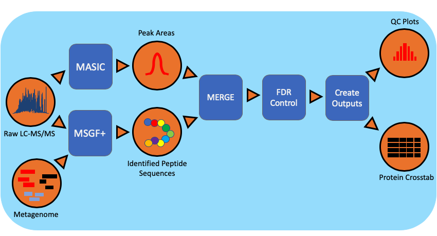

Metaproteomic Workflow
==============================

Summary
-------
The metaproteomics workflow/pipeline is an end-to-end data processing workflow for protein identification and characterization using MS/MS data. Briefly, mass spectrometry instrument generated data files(.RAW) are converted to mzML, an open data format, using MSConvert. Peptide identification is achieved using MSGF+ and the associated metagenomic information in the FASTA (protein sequences) file format. Intensity information for identified species is extracted using MASIC and combined with protein information.

Workflow Diagram
------------------

Workflow Dependencies
---------------------

Third party software
~~~~~~~~~~~~~~~~~~~~
.. code-block:: bash

    |----------------------------|------------------------------------------|
    | MSGFPlus                   | v20190628                                |
    | Mzid-To-Tsv-Converter      | v1.3.3                                   |
    | PeptideHitResultsProcessor | v1.5.7130                                |
    | pwiz-bin-windows           | x86_64-vc141-release-3_0_20149_b73158966 |
    | MASIC                      | v3.0.7235                                |
    | sqlite-netFx-full-source   | 1.0.111.0                                |
    | Conda                      | (3-clause BSD)                           |
    |                            |                                          |

Workflow Availability
---------------------

The workflow is available in GitHub:
https://github.com/microbiomedata/metaPro

The container is available at Docker Hub (microbiomedata/mepro):
https://hub.docker.com/r/microbiomedata/mepro

Inputs
~~~~~~~~

- `.raw`, `metagenome`, `parameter files : MSGFplus & MASIC`, `contaminant_file`

Outputs
~~~~~~~~

1. Processing multiple datasets.

.. code-block:: bash

        .
        ├── Data/
        ├── FDR_table.csv
        ├── Plots/
        ├── dataset_job_map.csv
        ├── peak_area_crosstab_by_dataset_id.csv
        ├── protein_peptide_map.csv
        ├── specID_table.csv
        └── spectra_count_crosstab_by_dataset_id.csv

2. Processing single FICUS dataset.

- metadatafile, [Example](https://jsonblob.com/400362ef-c70c-11ea-bf3d-05dfba40675b)

.. code-block:: bash

    | Keys               | Values                                                                   |
    |--------------------|--------------------------------------------------------------------------|
    | id                 | str: "md5 hash of $github_url+$started_at_time+$ended_at_time"           |
    | name               | str: "Metagenome:$proposal_extid_$sample_extid:$sequencing_project_extid |
    | was_informed_by    | str: "GOLD_Project_ID"                                                   |
    | started_at_time    | str: "metaPro start-time"                                                |
    | ended_at_time      | str: "metaPro end-time"                                                  |
    | type               | str: tag: "nmdc:metaPro"                                                 |
    | execution_resource | str: infrastructure name to run metaPro                                  |
    | git_url            | str: "url to a release"                                                  |
    | dataset_id         | str: "dataset's unique-id at EMSL"                                       |
    | dataset_name       | str: "dataset's name at EMSL"                                            |
    | has_inputs         | json_obj                                                                 |
    | has_outputs        | json_obj                                                                 |
    | stats              | json_obj                                                                 |

    has_inputs :
    | MSMS_out         | str: file_name \|file_size \|checksum                                                                                     |
    | metagenome_file  | str: file_name \|file_size \|checksum \|
                         int: entry_count(#of gene sequences) \|
                         int: duplicate_count(#of duplicate gene sequences) |
    | parameter_files  | str: for_masic/for_msgfplus : file_name \|file_size \|checksum
                         parameter file used for peptide identification search
    | Contaminant_file | str: file_name \|file_size \|checksum
                         (FASTA containing common contaminants in proteomics)

    has_outputs:
    | collapsed_fasta_file | str: file_name \|file_size \|checksum                                           |
    | resultant_file       | str: file_name \|file_size \|checksum                                           |
    | data_out_table       | str: file_name \|file_size \|checksum                                           |

    stats:
    | from_collapsed_fasta | int: entry_count(#of unique gene sequences)                                                                                                                                                                                                                                                                                                                                                                                                                                                                  |
    | from_resultant_file  | int: total_protein_count                                                                                                                                                                                                                                                                                                                                                                                                                                                                                          |
    | from_data_out_table  | int: PSM(# of MS/MS spectra matched to a peptide sequence at 5% false discovery rate (FDR)
                             float: PSM_identification_rate(# of peptide matching MS/MS spectra divided by total spectra searched (5% FDR)
                             int: unique_peptide_seq_count(# of unique peptide sequences observed in pipeline analysis 5% FDR)
                             int: first_hit_protein_count(# of proteins observed assuming single peptide-to-protein relationships)
                             int: mean_peptide_count(Unique peptide sequences matching to each identified protein.)

- data_out_table

.. code-block:: bash

    | DatasetName | PeptideSequence | FirstHitProtein | SpectralCount | sum(MasicAbundance) | GeneCount | FullGeneList | FirstHitDescription | DescriptionList | min(Qvalue) |

- collapsed_fasta_file
- resultant_file

Requirements for Execution
--------------------------

- Docker or other Container Runtime

Version History
---------------

- 1.0.0

Point of contact
----------------

Package maintainer: Anubhav <anubhav@pnnl.gov>
